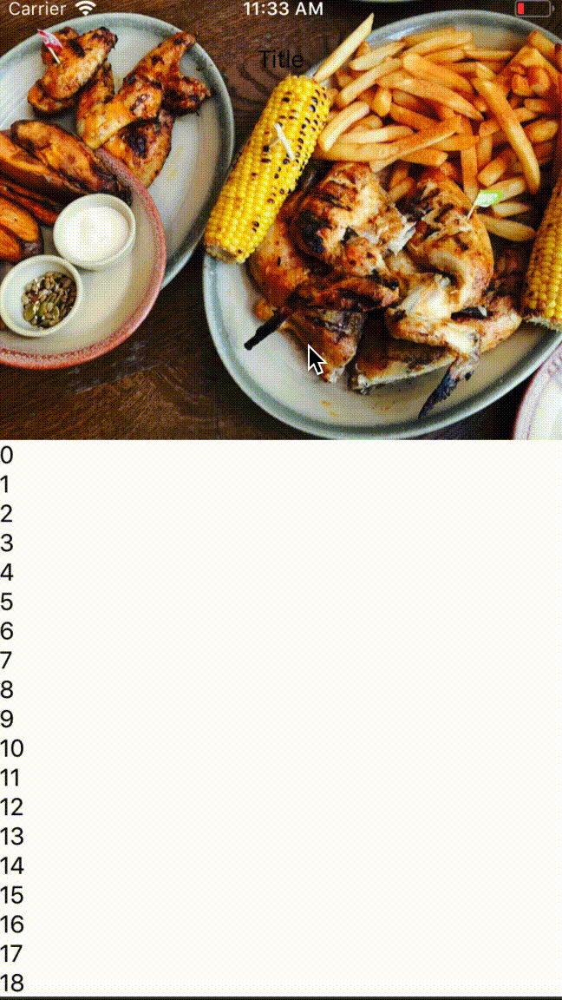

# Example
```js
//LIBRARIES
import React from "react";
import { View, Platform } from "react-native";
import RNParallaxScrollView from "rn-parallax-scroll-view";

const HEADER_MAX_HEIGHT = 300;
const HEADER_MIN_HEIGHT = Platform.OS === 'ios' ? 60 : 73;
const HEADER_SCROLL_DISTANCE = 240;

const thumbnail = require("./images/food.jpg");

class App extends React.Component{

  renderFixedHeader(){
    return(
      <View><Text>Title</Text></View>
    )
  }

  renderScrollViewContent() {
    const data = Array.from({ length: 30 });
    return (
      <View style={styles.scrollViewContent}>
        {data.map((_, i) => (
          <View key={i} style={styles.row}>
            <Text>{i}</Text>
          </View>
        ))}
      </View>
    );
  }
  render(){

    return (
      <View style={{flex:1}}>
        <RNParallaxScrollView
          thumbnail={thumbnail}
          renderFixedHeader={()=>this.renderFixedHeader()}
          renderScrollViewContent={()=>this.renderScrollViewContent()}
          transformHeader
        />
      </View>
    );
  }
}
export default App;
```

# react-native-parallax-scroll-view

A scroll view component that includes:

- parallax header
- sticky header
- customization
- Works on iOS and Android

## Installation

```
$ npm install rn-parallax-scroll-view --save
```

## Demo




## Usage (API)

All of the properties of `ScrollView` are supported. Please refer to the
[`ScrollView` documentation](https://facebook.github.io/react-native/docs/scrollview.html) for more detail.

The `ParallaxScrollView` component adds a few additional properties, as described below.

| Property | Type | Required | Description |
| -------- | ---- | -------- | ----------- |
| `headerMaxHeight` | `number` | No | The max height of the header defaults to  `300` |
| `headerMinHeight` | `number` | No | The max height of the header defaults to  `60` for ios and `73` for android |
| `headerScrollDistance` | `number` | No | Defaults to `240` |
| `renderFixedHeader` | `func` | Yes | Renders the fixed header |
| `renderScrollViewContent` | `func` | Yes | Renders the scroll view content | 
| `headerBarStyles` | `object` | No | Header component styles |
| `transformHeader` | `bool` | No | Is header scalable |
| `headerWrapperStyles` | `object` | No | Header wrapper for wrapping the header |
| `backgroundImageStyles` | `object` | No | Style background Image |


## Contributing

I welcome contributions! Please open an issues if you have any feature ideas
or find any bugs. I also accept pull requests with open arms. I will
go over the issues when I have time. :)
